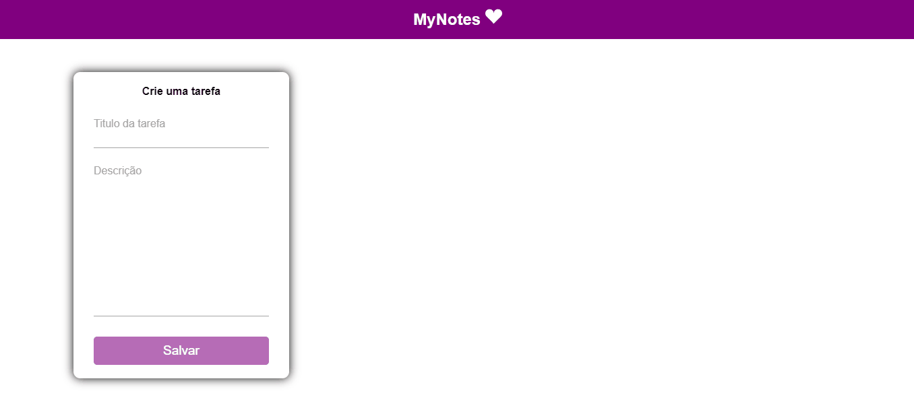
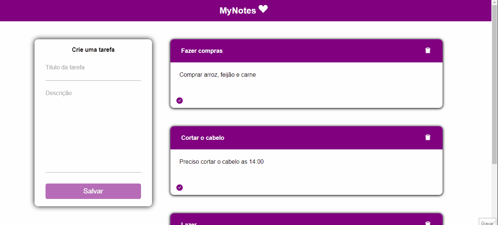
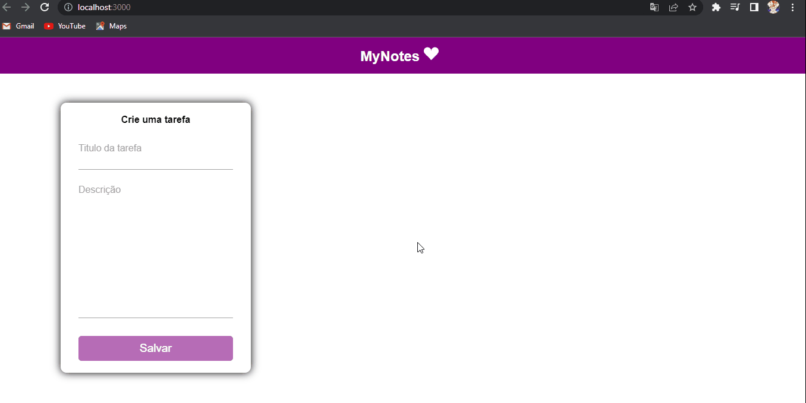

<div align="center">
    <h1>MyNotes</h1>
</div>

<p align="center">Este é um aplicativo para anotar suas tarefas do dia a dia.</p>

--- 

## Features ✨

- [x] Adiciona tarefas
- [x] Apaga tarefas
- [x] Marca tarefas como realizada
- [x] Edita tarefas 
- [x] Responsividade

## Demo 📷

<h1 align="center">
    
</h1>

<h1 align="center">
    
</h1>

<h1 align="center">
    
</h1>

<h1 align="center">
    
</h1>

<br>

## Pré requisitos

- [Git](https://git-scm.com)
- [Node.js](https://nodejs.org/en/)

É bom que tenha um [Vscode](https://code.visualstudio.com/) para editar o código

<br>

## Rodando a aplicação

Em terminais separados você irá rodar o backend e o frontend:


```bash
   #Clone o repositório
   git clone https://github.com/Kakaziu/MyNotes

   # Backend:
   # Ir até a pasta

   cd myNotes
   cd backend

   npm run dev


```

Em outro terminal

```bash
    # Frontend:

    cd myNotes
    cd frontend

    npm start
```

<br>

## Tecnologias

- [Node.js](https://nodejs.org/en/)
- [React.js](https://pt-bt.reactjs.org/)
- [Javascript](https://www.javascript.com/)

---

Obrigado a atenção de quem veio até aqui 🧡 | [Linkedin](https://www.linkedin.com/in/kau%C3%A3-borba-390946235/) 
